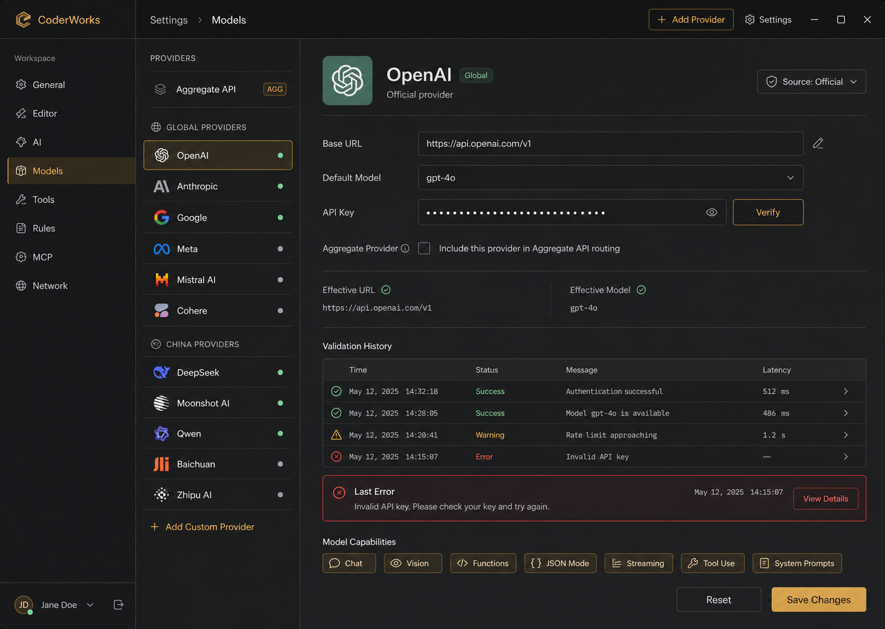
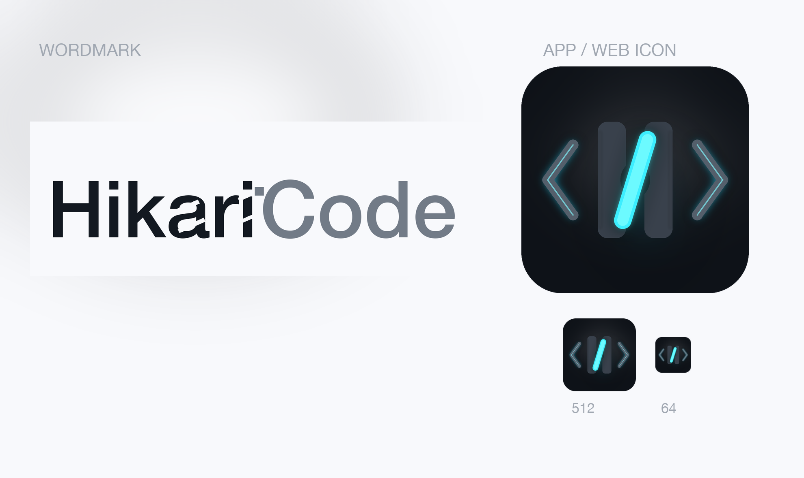

# HikariCode

HikariCode is a desktop-first, local-first AI coding agent. This public repository is the product's public distribution home: it keeps release notes, screenshots, update metadata, and packaged desktop installers, while the private product source code stays in the internal repository.

HikariCode 是一个桌面优先、本地执行、对话驱动的 AI 编程 Agent。这个公开仓库是产品的公开发布主页，只保存版本说明、截图、更新清单和桌面安装包，私有业务源码仍在内部仓库维护。

## Maintenance / 维护

- This repository is the public distribution target for HikariCode.
- Most files here are generated or refreshed by publish scripts from the private source repository.
- This repository does not handle deployment; maintainers only update public assets, then commit and push.

- 这个仓库是 HikariCode 的公开发布落点。
- 这里的大部分文件由外层私有源码仓库的发布脚本生成或刷新。
- 这里不承担部署，只做公开资产维护，然后提交并推送。

## Downloads / 下载

- Latest release / 最新版本: [v0.1.0](https://github.com/hikariCodeAi/HikariCode/releases/tag/v0.1.0)
- Release notes / 版本说明: [v0.1.0](https://github.com/hikariCodeAi/HikariCode/blob/main/release-notes/v0.1.0.md)
- Update manifest / 更新清单: [update/latest.json](https://hikariCodeAi.github.io/HikariCode/update/latest.json)

## What Is Public / 公开内容

- Packaged desktop installers published through GitHub Releases.
- Bilingual product overview, screenshots, release notes, and per-platform update metadata.
- No private product source code, build graph internals, or proprietary implementation files.

## 仓库说明

- 通过 GitHub Releases 分发桌面安装包。
- 提供中英双语产品介绍、截图、release notes 和按平台区分的更新清单。
- 不公开私有产品源码、内部构建细节或专有实现文件。

## Screenshots / 截图

